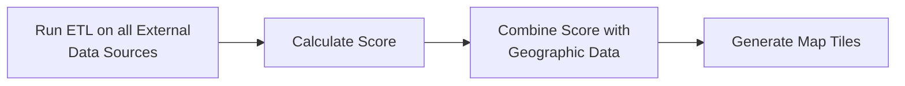

# Justice40 Data Pipeline and Scoring Application

## Table of Contents

- [About](#about)
- [Accessing Data](#accessing-data)
- [Installing the Data Pipeline and Scoring Application](#installing-the-data-pipeline-and-scoring-application)
- [Running the Data Pipeline and Scoring Application](#running-the-data-pipeline-and-scoring-application)
- [How Scoring Works](#how-scoring-works)
- [Comparing Scores](#comparing-scores)
- [Testing](#testing)

## About

The Justice40 Data Pipeline and Scoring Application is used to retrieve input data sources, perform Extract-Transform-Load (ETL) operations on those data sources, and ultimately generate the scores and supporting data (e.g. map tiles) consumed by the [Climate and Economic Justice Screening Tool (CEJST) website](https://screeningtool.geoplatform.gov/). This data can also be used to compare experimental versions of the Justice40 score to established environmental justice indices, such as EJSCREEN and CalEnviroScreen.

> :exclamation: **ATTENTION**  
> The Council on Environmental Quality (CEQ) [made version 1.0 of the CEJST available in November 2022](https://www.whitehouse.gov/ceq/news-updates/2022/11/22/biden-harris-administration-launches-version-1-0-of-climate-and-economic-justice-screening-tool-key-step-in-implementing-president-bidens-justice40-initiative/). Future versions are in continuous development, and scores are likely to change over time. Only versions made publicly available via the CEJST by CEQ may be used for the Justice40 Initiative.

We believe that the entire data pipeline should be open and replicable end-to-end. As part of this, in addition to all code being open, we also strive to make data visible and available for use at every stage of our pipeline. You can follow the installation instructions below to spin up the data pipeline yourself in your own environment; you can also access the data we've already processed.

## Accessing Data

If you wish to access our data without running the Justice40 Data Pipeline and Scoring Application locally, you can do so using the following links.

| Dataset                                          | Location                                                                                                                           |
| ------------------------------------------------ | ---------------------------------------------------------------------------------------------------------------------------------- |
| Source Data                                      | You can find the source URLs in the `etl.py` files located within each directory in `data/data-pipeline/etl/sources`               |
| Version 1.0 Combined Datasets (from all Sources) | [Download](https://static-data-screeningtool.geoplatform.gov/data-versions/1.0/data/score/csv/full/usa.csv)                        |
| Shape Files for Mapping Applications             | [Download](https://static-data-screeningtool.geoplatform.gov/data-versions/1.0/data/score/downloadable/1.0-shapefile-codebook.zip) |
| Documentation and Other Downloads                | [Climate and Economic Justice Screening Tool Downloads](https://screeningtool.geoplatform.gov/en/downloads)                        |

## Installing the Data Pipeline and Scoring Application

If you wish to run the Justice40 Data Pipeline and Scoring Application in your own environment, you have the option of using Docker or setting up a local environment. Docker allows you to install and run the application inside a container without setting up a local environment, and is the quickest and easiest option. A local environment requires you to set up your system manually, but provides the ability to make changes and run individual parts of the application without the need for Docker.

With either choice, you'll first need to perform some installation steps.

### Installing Docker

To install Docker, follow these [instructions](https://docs.docker.com/get-docker/). After installation is complete, visit [Running with Docker](#running-with-docker) for more information.

---

### Installing Your Local Environment

The detailed steps for performing [local environment installation can be found in our guide](INSTALLATION.md). After installation is complete, visit [Running the Application Locally](#running-in-your-local-environment) for more information.

## Running the Data Pipeline and Scoring Application

The Justice40 Data Pipeline and Scoring Application is a multistep process that,

1. Retrieves input data sources (extract), standardizes those input data sources' data into an intermediate format (transform), and saves the results to the file system (load). It performs those steps for each configured input data source (found at [`data_pipeline/etl/sources`](data_pipeline/etl/sources))
2. Calculates a score
3. Combines the score with geographic data
4. Generates map tiles for use in the client website



You can perform these steps either using Docker or by running the application in your local environment.

### Running with Docker

Docker can be used to run the application inside a container without setting up a local environment.

> :exclamation: **ATTENTION**  
> You must increase the memory resource of your container to at least 8096 MB to run this application in Docker

Before running with Docker, you must build the Docker container. Make sure you're in the root directory of the repository (`/justice40-tool`) and run `docker-compose build --no-cache`.

Once you've built the Docker container, run `docker-compose up`. Docker will spin up 3 containers: the client container, the static server container and the data container. Once all data is generated, you can see the application by navigating to [http://localhost:8000](http://localhost:8000) in your browser.

<details>
<summary>View additional commands</summary>

If you want to run specific data tasks, you can open a terminal window, navigate to the root folder for this repository, and execute any command for the application using this format:

`docker run --rm -it -v ${PWD}/data/data-pipeline/data_pipeline/data:/data_pipeline/data j40_data_pipeline python3 -m data_pipeline.application [command]`

- Get help: `docker run --rm -it -v ${PWD}/data/data-pipeline/data_pipeline/data:/data_pipeline/data j40_data_pipeline python3 -m data_pipeline.application --help`
- Generate census data: `docker run --rm -it -v ${PWD}/data/data-pipeline/data_pipeline/data:/data_pipeline/data j40_data_pipeline python3 -m data_pipeline.application census-data-download`
- Run all ETL and Generate score: `docker run --rm -it -v ${PWD}/data/data-pipeline/data_pipeline/data:/data_pipeline/data j40_data_pipeline python3 -m data_pipeline.application score-full-run`
- Clean up the data directories: `docker run --rm -it -v ${PWD}/data/data-pipeline/data_pipeline/data:/data_pipeline/data j40_data_pipeline python3 -m data_pipeline.application data-cleanup`
- Run all ETL processes: `docker run --rm -it -v ${PWD}/data/data-pipeline/data_pipeline/data:/data_pipeline/data j40_data_pipeline python3 -m data_pipeline.application etl-run`
- Generate Score: `docker run --rm -it -v ${PWD}/data/data-pipeline/data_pipeline/data:/data_pipeline/data j40_data_pipeline python3 -m data_pipeline.application score-run`
- Combine Score with Geojson and generate high and low zoom map tile sets: `docker run --rm -it -v ${PWD}/data/data-pipeline/data_pipeline/data:/data_pipeline/data j40_data_pipeline python3 -m data_pipeline.application geo-score`
- Generate Map Tiles: `docker run --rm -it -v ${PWD}/data/data-pipeline/data_pipeline/data:/data_pipeline/data j40_data_pipeline python3 -m data_pipeline.application generate-map-tiles`

To learn more about these commands and when they should be run, refer to [Running for Local Development](#running-for-local-development).
</details>

---

### Running in Your Local Environment

When running in your local environment, each step of the application can be run individually or as a group.

> :bulb: **NOTE**  
> This section only describes the steps necessary to run the Justice40 Data Pipeline and Scoring Application. If you'd like to run the client application, visit the [client README](/client/README.md). Please note that the client application does not use the data locally generated by the application by default.

Start by familiarizing yourself with the available commands. To do this, navigate to `justice40-tool/data/data-pipeline` and run `poetry run python3 data_pipeline/application.py --help`. You'll see a list of commands and what those commands do. You can also request help on any individual command to get more information about command options (e.g. `poetry run python3 data_pipeline/application.py etl-run --help`).

> :exclamation: **ATTENTION**  
> Some commands fetch large amounts of data from remote data sources or run resource-intensive calculations. They may take a long time to complete (e.g. generate-map-tiles can take over 30 minutes). Those that fetch data from remote data sources (e.g. `etl-run`) should not be run too often; if they are, you may get throttled or eventually blocked by the sites serving the data.

#### Download Census Data

Begin the process of running the application in your local environment by downloading census data.

> :bulb: **NOTE**  
> You'll only need to do this once (unless you clean your census data folder)! Subsequent runs will use the data you've already downloaded.

To download census data, run the command `poetry run python3 data_pipeline/application.py census-data-download`.

If you have a high speed internet connection and don't want to generate the census data or install `GDAL` locally, you can download [a zip version of the Census file](https://justice40-data.s3.amazonaws.com/data-sources/census.zip). Unzip and move the contents inside the `data/data-pipeline/data_pipeline/data/census` folder.

#### Run the Application

Running the application in your local environment allows the most flexibility. You can pick and choose which commands you run, and test parts of the application individually or as a group. While we can't anticipate all of your individual development scenarios, we can give you the steps you'll need to run the application from start to finish.

Once you've downloaded the census data, run the following commands – in order – to exercise the entire Data Pipeline and Scoring Application. The commands can be run from `justice40-tool/data/data-pipeline` in the form `poetry run python3 data_pipeline/application.py insert-name-of-command-here`.

| Step | Command               | Description                                                                                                                                                           | Example Output                                            |
| ---- | --------------------- | --------------------------------------------------------------------------------------------------------------------------------------------------------------------- | --------------------------------------------------------- |
| 1    | `etl-run`             | Performs the ETL steps on all external data sources, and saves the resulting intermediate file                                                                        | `data/dataset`                                            |
| 2    | `score-run`           | Generates and stores the score                                                                                                                                        | `data/score/csv/full/usa.csv`                             |
| 3    | `generate-score-post` | Performs a host of post-score activities, including adding county and state data to the score, shortening column names, and generating a downloadable package of data | `data/score/csv/tiles/usa.csv`, `data/score/downloadable` |
| 4    | `geo-score`           | Merges geoJSON data with score data, creating both high and low resolution results                                                                                    | `data/score/geojson[usa high or low]`                     |
| 5    | `generate-map-tiles`  | Generates map tiles for use in client website                                                                                                                         | `data/score/tiles/ high or low / {zoomLevel}`             |

Many commands have options. For example, you can run a single dataset with `etl-run` by passing the command line parameter `-d name-of-dataset-to-run`. Please use the `--help` option to find out more.

> :bulb: **NOTE**  
> One important command line option is enabling cached data sources. Pass the command line parameter `-u` to many commands (e.g. `etl-run`) to use locally cached data sources within the ETL portion of the pipeline. This will ensure that you don't download many GB of data with each run of the data pipeline.

## How Scoring Works

Scores are generated by running the `score-run` command via Poetry or Docker. This command executes [`data_pipeline/etl/score/etl_score.py`](data_pipeline/etl/score/etl_score.py). During execution,

1. Source files from the [`data_pipeline/data/dataset`](data_pipeline/data/dataset) directory are loaded into memory (these source files were generated by the `etl-run` command)
2. These data sets are merged into a single dataframe using their Census Block Group GEOID as a common key, and the data in each of the columns is standardized in two ways:
   - Their [percentile rank](https://en.wikipedia.org/wiki/Percentile_rank) is calculated, which tells us what percentage of other Census Block Groups have a lower value for that particular column.
   - They are normalized using [min-max normalization](https://en.wikipedia.org/wiki/Feature_scaling), which adjusts the scale of the data so that the Census Block Group with the highest value for that column is set to 1, the Census Block Group with the lowest value is set to 0, and all of the other values are adjusted to fit within that range based on how close they were to the highest or lowest value.
3. The standardized columns are then used to calculate each of the Justice40 scores, and the results are exported to `data_pipeline/data/score/csv/full/usa.csv`. Different versions of the scoring algorithm – including the current version – can be found in [`data_pipeline/score`](data_pipeline/score).

## Comparing Scores

Scores can be compared to both internally calculated scores and scores calculated by other existing indices.

### Internal Comparison

Locally calculated scores can be easily compared with the score in production by using the [Score Comparator](data_pipeline/comparator.py). The score comparator compares the number and name of the columns, the number of census tracts (rows), and the score values (if the columns and census tracts line up).

The Score Comparator runs on every Github Pull Request, but can be run manually by `poetry run python3 data_pipeline/comparator.py compare-score` from the `justice40-tool/data/data-pipeline` directory.

### External Comparison

We are building a comparison tool to enable easy (or at least straightforward) comparison of the Justice40 score with other existing indices. The goal of having this is so that as we experiment and iterate with a scoring methodology, we can understand how our score overlaps with or differs from other indices that communities, nonprofits, and governments use to inform decision making.

Right now, our comparison tool exists simply as a python notebook in `data/data-pipeline/data_pipeline/ipython/scoring_comparison.ipynb`.

To run this comparison tool:

1. Make sure you've gone through the above steps to run the data ETL and score generation.
1. From the package directory (`data/data-pipeline/data_pipeline/`), navigate to the `ipython` directory.
1. Ensure you have `pandoc` installed on your computer. If you're on a Mac, run `brew install pandoc`; for other OSes, see pandoc's [installation guide](https://pandoc.org/installing.html).
1. Start the notebooks: `jupyter notebook`
1. In your browser, navigate to one of the URLs returned by the above command.
1. Select `scoring_comparison.ipynb` from the options in your browser.
1. Run through the steps in the notebook. You can step through them one at a time by clicking the "Run" button for each cell, or open the "Cell" menu and click "Run all" to run them all at once.
1. Reports and spreadsheets generated by the comparison tool will be available in `data/data-pipeline/data_pipeline/data/comparison_outputs`.

> :exclamation: **ATTENTION**  
> This may take over an hour to fully execute and generate the reports.

## Testing

### Background

<!-- markdown-link-check-disable -->

For this project, we make use of [pytest](https://docs.pytest.org/en/latest/) for testing purposes.

<!-- markdown-link-check-enable-->

To run tests, simply run `poetry run pytest` in this directory (`justice40-tool/data/data-pipeline`).

Test data is configured via [fixtures](https://docs.pytest.org/en/latest/explanation/fixtures.html).

### Running the Full Suite

Our _full_ test and check suite – including security and code format checks – is configured using [`tox`](tox.ini). This suite can be run using the command `poetry run tox` from the `justice40-tool/data/data-pipeline` directory.

Each run takes a while to build the environment from scratch. If you'd like to save time, you can use the previously built environment by running `poetry run tox -e lint`.

### Score and Post-Processing Tests

The fixtures used in the score post-processing tests are slightly different. These fixtures use [pickle files](https://docs.python.org/3/library/pickle.html) to store dataframes to disk. This is ultimately because if you assert equality on two dataframes, even if column values have the same _visible_ value, if their types are mismatching they will be counted as not being equal.

In a bit more detail:

1. Pandas dataframes are typed, and by default, types are inferred when you create one from scratch. If you create a dataframe using the `DataFrame` [constructors](https://pandas.pydata.org/docs/reference/api/pandas.DataFrame.html#pandas.DataFrame), there is no guarantee that types will be correct, without explicit `dtype` annotations. Explicit `dtype` annotations are possible, but, and this leads us to point #2:
2. Our transformations/dataframes in the source code under test itself doesn't always require specific types, and it is often sufficient in the code itself to just rely on the `object` type. I attempted adding explicit typing based on the "logical" type of given columns, but in practice it resulted in non-matching dataframes that _actually_ had the same value – in particular it was very common to have one dataframe column of type `string` and another of type `object` that carried the same values. So, that is to say, even if we did create a "correctly" typed dataframe (according to our logical assumptions about what types should be), they were still counted as mismatched against the dataframes that are actually used in our program. To fix this "the right way", it is necessary to explicitly annotate types at the point of the `read_csv` call, which definitely has other potential unintended side effects and would need to be done carefully.
3. For larger dataframes (some of these have 150+ values), it was initially deemed too difficult/time consuming to manually annotate all types, and further, to modify those type annotations based on what is expected in the soucre code under test.

#### Updating Pickles

If you update the score in any way, it is necessary to create new pickles so that data is validated correctly.

It starts with the `data_pipeline/etl/score/tests/sample_data/score_data_initial.csv`, which is the first two rows of the `score/full/usa.csv`.

To update this file, run a full score generation, then open a Python shell from the `data-pipeline` directory (e.g. `poetry run python3`), and then update the file with the following commands:

```
import pickle
from pathlib import Path
import pandas as pd
data_path = Path.cwd()

# score data expected
score_csv_path = data_path / "data_pipeline" / "data" / "score" / "csv" / "full" / "usa.csv"
score_initial_df = pd.read_csv(score_csv_path, dtype={"GEOID10_TRACT": "string"}, low_memory=False, nrows=2)
score_initial_df.to_csv(data_path / "data_pipeline" / "etl" / "score" / "tests" / "sample_data" /"score_data_initial.csv", index=False)
```

Now you can move on to updating individual pickles for the tests.

> :bulb: **NOTE**  
> It is helpful to perform the steps in VS Code, and in this order.

We have four pickle files that correspond to expected files:

| Pickle                           | Purpose                                                                                                                                                                        |
| -------------------------------- | ------------------------------------------------------------------------------------------------------------------------------------------------------------------------------ |
| `score_data_expected.pkl`        | Initial score without counties                                                                                                                                                 |
| `score_transformed_expected.pkl` | Intermediate score with `etl._extract_score` and `etl. _transform_score` applied. There's no file for this intermediate process, so we need to capture the pickle mid-process. |
| `tile_data_expected.pkl`         | Score with columns to be baked in tiles                                                                                                                                        |
| `downloadable_data_expected.pk1` | Downloadable csv                                                                                                                                                               |

To update the pickles, go one by one:

For the `score_transformed_expected.pkl`, put a breakpoint on [this line](https://github.com/usds/justice40-tool/blob/main/data/data-pipeline/data_pipeline/etl/score/tests/test_score_post.py#L62), before the `pdt.assert_frame_equal` and run:
`pytest data_pipeline/etl/score/tests/test_score_post.py::test_transform_score`

Once on the breakpoint, capture the df to a pickle as follows:

```
import pickle
from pathlib import Path
data_path = Path.cwd()
score_transformed_actual.to_pickle(data_path / "data_pipeline" / "etl" / "score" / "tests" / "snapshots" / "score_transformed_expected.pkl", protocol=4)
```

Then take out the breakpoint and re-run the test: `pytest data_pipeline/etl/score/tests/test_score_post.py::test_transform_score`

For the `score_data_expected.pkl`, put a breakpoint on [this line](https://github.com/usds/justice40-tool/blob/main/data/data-pipeline/data_pipeline/etl/score/tests/test_score_post.py#L78), before the `pdt.assert_frame_equal` and run:
`pytest data_pipeline/etl/score/tests/test_score_post.py::test_create_score_data`

Once on the breakpoint, capture the df to a pickle as follows:

```
import pickle
from pathlib import Path
data_path = Path.cwd()
score_data_actual.to_pickle(data_path / "data_pipeline" / "etl" / "score" / "tests" / "snapshots" / "score_data_expected.pkl", protocol=4)
```

Then take out the breakpoint and re-run the test: `pytest data_pipeline/etl/score/tests/test_score_post.py::test_create_score_data`

For the `tile_data_expected.pkl`, put a breakpoint on [this line](https://github.com/usds/justice40-tool/blob/main/data/data-pipeline/data_pipeline/etl/score/tests/test_score_post.py#L90), before the `pdt.assert_frame_equal` and run:
`pytest data_pipeline/etl/score/tests/test_score_post.py::test_create_tile_data`

Once on the breakpoint, capture the df to a pickle as follows:

```
import pickle
from pathlib import Path
data_path = Path.cwd()
output_tiles_df_actual.to_pickle(data_path / "data_pipeline" / "etl" / "score" / "tests" / "snapshots" / "tile_data_expected.pkl", protocol=4)
```

Then take out the breakpoint and re-run the test: `pytest data_pipeline/etl/score/tests/test_score_post.py::test_create_tile_data`

For the `downloadable_data_expected.pk1`, put a breakpoint on [this line](https://github.com/usds/justice40-tool/blob/main/data/data-pipeline/data_pipeline/etl/score/tests/test_score_post.py#L98), before the `pdt.assert_frame_equal` and run:
`pytest data_pipeline/etl/score/tests/test_score_post.py::test_create_downloadable_data`

Once on the breakpoint, capture the df to a pickle as follows:

```
import pickle
from pathlib import Path
data_path = Path.cwd()
output_downloadable_df_actual.to_pickle(data_path / "data_pipeline" / "etl" / "score" / "tests" / "snapshots" / "downloadable_data_expected.pkl", protocol=4)
```

Then take out the breakpoint and re-run the test: `pytest data_pipeline/etl/score/tests/test_score_post.py::test_create_downloadable_data`

#### Future Enhancements

Pickles have several downsides that we should consider alternatives for:

1. They are opaque - it is necessary to open a python interpreter (as written above) to confirm its contents
2. They are a bit harder for newcomers to python to grok.
3. They potentially encode flawed typing assumptions (see above) which are paved over for future test runs.

In the future, we could adopt any of the below strategies to work around this:

1. We could use [pytest-snapshot](https://pypi.org/project/pytest-snapshot/) to automatically store the output of each test as data changes. This would make it so that you could avoid having to generate a pickle for each method - instead, you would only need to call `generate` once , and only when the dataframe had changed.

<!-- markdown-link-check-disable -->

Additionally, you could use a pandas type schema annotation such as [pandera](https://pandera.readthedocs.io/en/stable/schema_models.html?highlight=inputschema#basic-usage) to annotate input/output schemas for given functions, and your unit tests could use these to validate explicitly. This could be of very high value for annotating expectations.

<!-- markdown-link-check-enable-->

Alternatively, or in conjunction, you could move toward using a more strictly-typed container format for read/writes such as SQL/SQLite, and use something like [SQLModel](https://github.com/tiangolo/sqlmodel) to handle more explicit type guarantees.

### Fixtures used in ETL "Snapshot Tests"

ETLs are tested for the results of their extract, transform, and load steps by borrowing the concept of "snapshot testing" from the world of front-end development.

Snapshots are easy to update and demonstrate the results of a series of changes to the code base. They are good for making sure no results have changed if you don't expect them to change, and they are good when you expect the results to significantly change in a way that would be tedious to update in traditional unit tests.

However, snapshot tests are also dangerous. An unthinking developer may update the snapshot fixtures and unknowingly encode a bug into the supposed intended output of the test.

In order to update the snapshot fixtures of an ETL class, follow the following steps:

1. If you need to manually update the fixtures, update the "furthest upstream" source that is called by `_setup_etl_instance_and_run_extract`. For instance, this may involve creating a new zip file that imitates the source data. (e.g., for the National Risk Index test, update `data_pipeline/tests/sources/national_risk_index/data/NRI_Table_CensusTracts.zip` which is a 64kb imitation of the 405MB source NRI data.)
2. Run `pytest . -rsx --update_snapshots` to update snapshots for all files, or you can pass a specific file name to pytest to be more precise (e.g., `pytest data_pipeline/tests/sources/national_risk_index/test_etl.py -rsx --update_snapshots`)
3. Re-run pytest without the `update_snapshots` flag (e.g., `pytest . -rsx`) to ensure the tests now pass.
4. Carefully check the `git diff` for the updates to all test fixtures to make sure these are as expected. This part is very important. For instance, if you changed a column name, you would only expect the column name to change in the output. If you modified the calculation of some data, spot check the results to see if the numbers in the updated fixtures are as expected.

### Other ETL Unit Tests

Outside of the ETL snapshot tests discussed above, ETL unit tests are typically organized into three buckets:

- Extract Tests
- Transform Tests, and
- Load Tests

These are tested using different strategies explained below.

#### Extract Tests

Extract tests rely on the limited data transformations that occur as data is loaded from source files.

In tests, we use fake, limited CSVs read via `StringIO` , taken from the first several rows of the files of interest, and ensure data types are correct.

Down the line, we could use a tool like [Pandera](https://pandera.readthedocs.io/) to enforce schemas, both for the tests and the classes themselves.

#### Transform Tests

Transform tests are the heart of ETL unit tests, and compare ideal dataframes with their actual counterparts.

See above [Fixtures](#configuration--fixtures) section for information about where data is coming from.

#### Load Tests

These make use of [tmp_path_factory](https://docs.pytest.org/en/latest/how-to/tmp_path.html) to create a file-system located under `temp_dir`, and validate whether the correct files are written to the correct locations.

Additional future modifications could include the use of Pandera and/or other schema validation tools, and or a more explicit test that the data written to file can be read back in and yield the same dataframe.

### Smoketests

To ensure the score and tiles process correctly, there is a suite of "smoke tests" that can be run after the ETL and score data have been run, and outputs like the frontend GEOJSON have been created.
These tests are implemented as pytest test, but are skipped by default. To run them.

1. Generate a full score with `poetry run python3 data_pipeline/application.py score-full-run`
2. Generate the tile data with `poetry run python3 data_pipeline/application.py generate-score-post`
3. Generate the frontend GEOJSON with `poetry run python3 data_pipeline/application.py geo-score`
4. Select the smoke tests for pytest with `poetry run pytest data_pipeline/tests -k smoketest`
