# Architecture

The below is a general architecture of our proposed system:

The following is a more detailed diagram of the data pipeline architecture utilizing S3 buckets for file/data hosting on Geoplatform.gov.

## Updating the Diagram

**Note: Do Not directly modify the svg file, it is generated automatically!**

In the event that you are interested in updating the architecture of our system, please go through the Architecture Decision Record Process (see [here](https://github.com/usds/justice40-tool/tree/main/docs/decisions) for more detail on this process).

Provided you have already done this, however, and/or would like to make small changes to the diagram itself, please read on!

This diagram was generated from a text-based markdown-like file using [MermaidJS](https://mermaid-js.github.io/) syntax and the [Compile Mermaid Markdown](https://github.com/neenjaw/compile-mermaid-markdown-action) Github Action.

To update, consult Mermaid syntax [here](https://mermaid-js.github.io/mermaid/#/flowchart) and update the `architecture.mmd` file.

To preview your changes, see Use Cases and Integrations [here](https://mermaid-js.github.io/mermaid/#/integrations) in order to setup editor integration.

Once you are satisfied with your change, create a pull request. The `compile_mermaid.yml` workflow ([here](https://github.com/usds/justice40-tool/blob/main/.github/workflows/compile_mermaid.yml)) will automatically generate and commit an SVG version of your diagram with the name `X.svg`.
