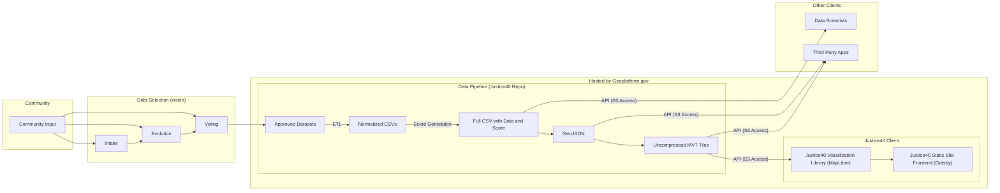
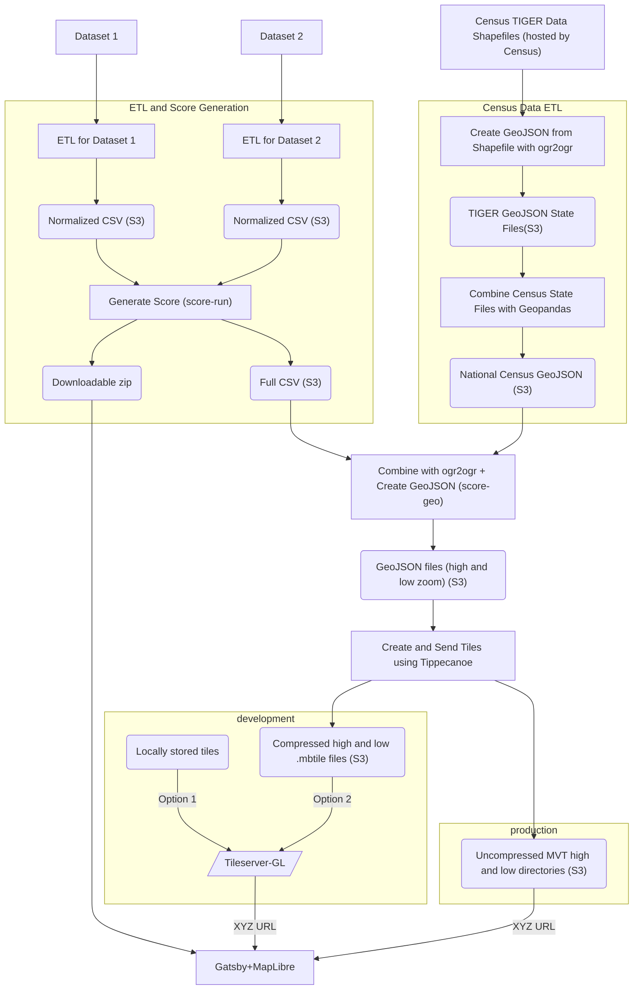

# Architecture

The below is a general architecture of our proposed system:

The following is a more detailed diagram of the data pipeline architecture utilizing S3 buckets for file/data hosting on Geoplatform.gov.

## Updating the Diagram

In the event that you are interested in updating the architecture of our system, please go through the Architecture Decision Record Process (see [here](https://github.com/usds/justice40-tool/tree/main/docs/decisions) for more detail on this process).

Provided you have already done this, however, and/or would like to make small changes to the diagram itself, please read on!

To update, consult Mermaid syntax [here](https://mermaid-js.github.io/mermaid/#/flowchart) and update the above mermaid syntax.

To preview your changes, see Use Cases and Integrations [here](https://mermaid-js.github.io/mermaid/#/integrations) in order to setup editor integration.

Once you are satisfied with your change, create a pull request. Github will automatically detect the mermaid tag and compile the diagram in-line.
