# Architecture

The below is a general architecture of our proposed system:

## Updating

**Note: Do Not directly modify the svg file, it is generated automatically!**

This diagram was generated from a text-based markdown-like file using [MermaidJS](https://mermaid-js.github.io/) syntax and the [Compile Mermaid Markdown](https://github.com/marketplace/actions/compile-mermaid-markdown) Github Action.

To update, consult Mermaid syntax [here](https://mermaid-js.github.io/mermaid/#/flowchart) and update the `architecture.mmd` file.

To preview your changes, see Use Cases and Integrations [here](https://mermaid-js.github.io/mermaid/#/integrations) in order to setup editor integration.

Once you are satisfied with your change, create a pull request. The `compile_mermaid.yml` workflow ([here](https://github.com/usds/justice40-tool/blob/main/.github/workflows/compile_mermaid.yml)) will automatically generate and commit an SVG version of your diagram with the name `X.svg`.
