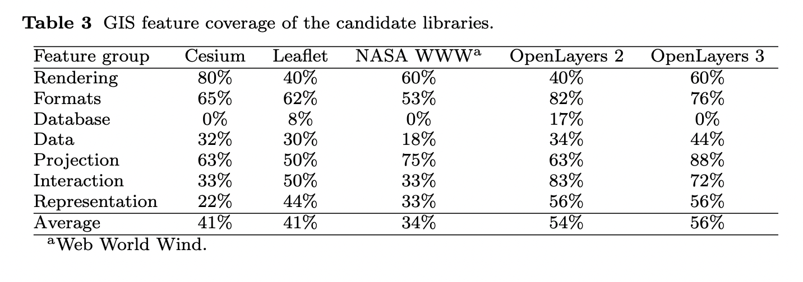
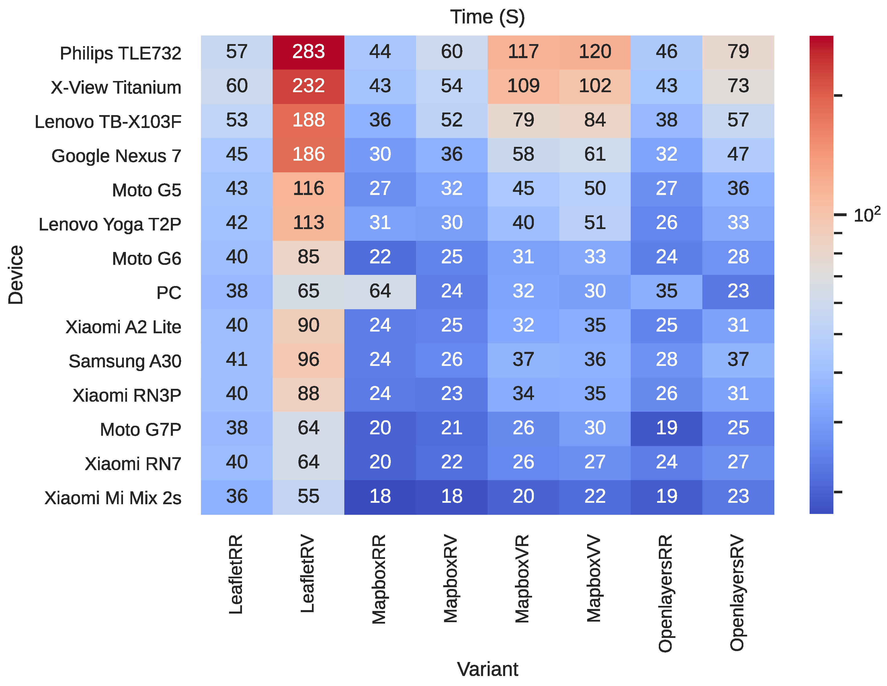
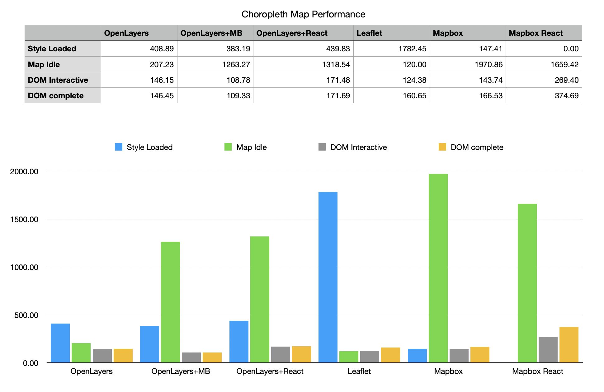
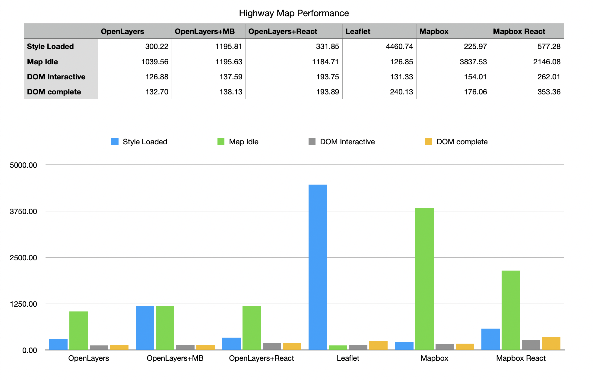
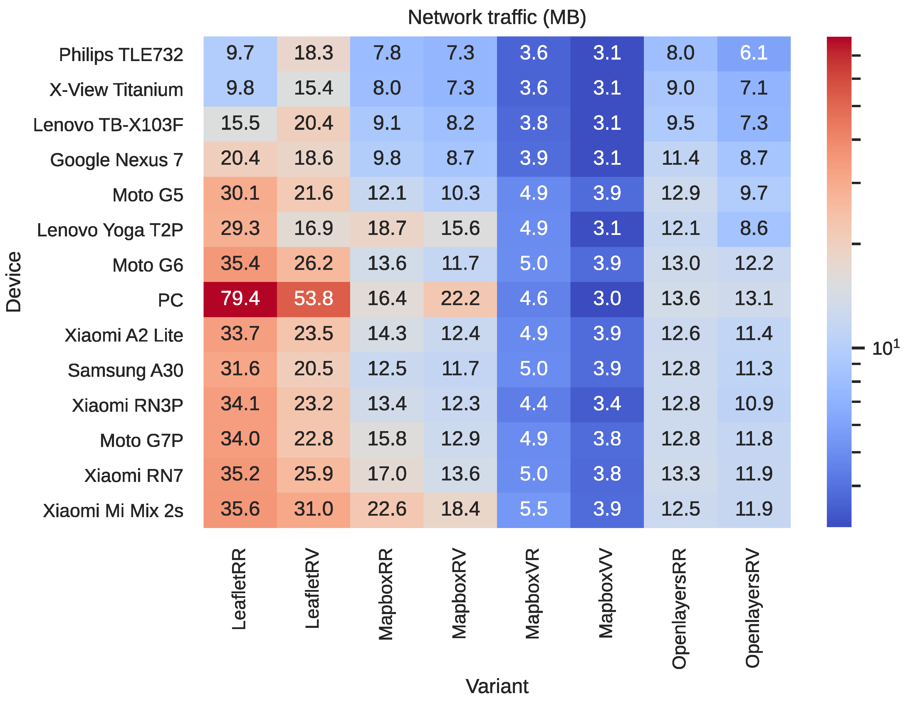
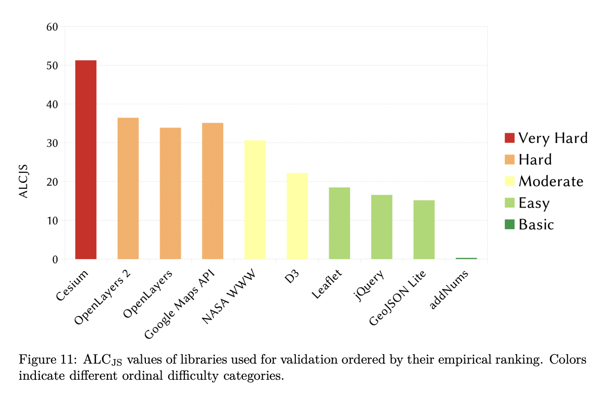
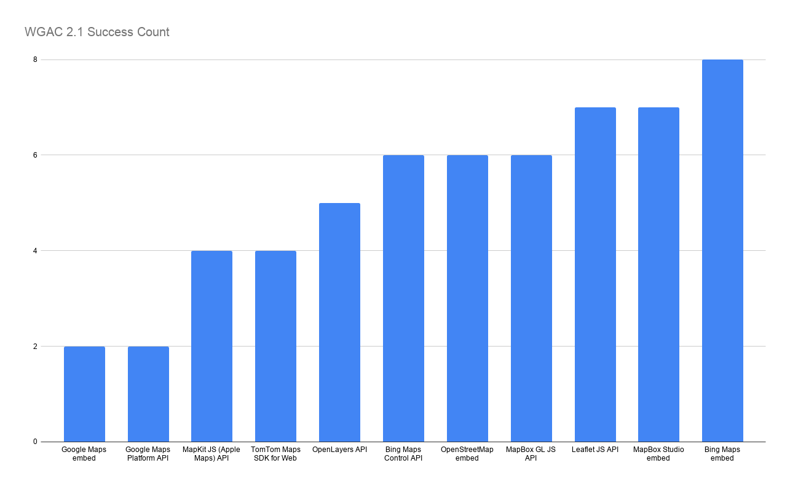
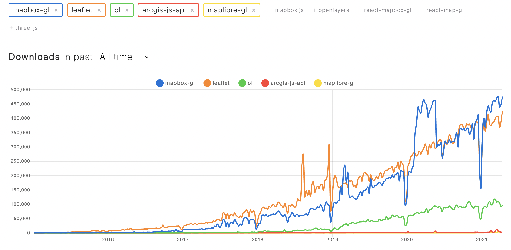
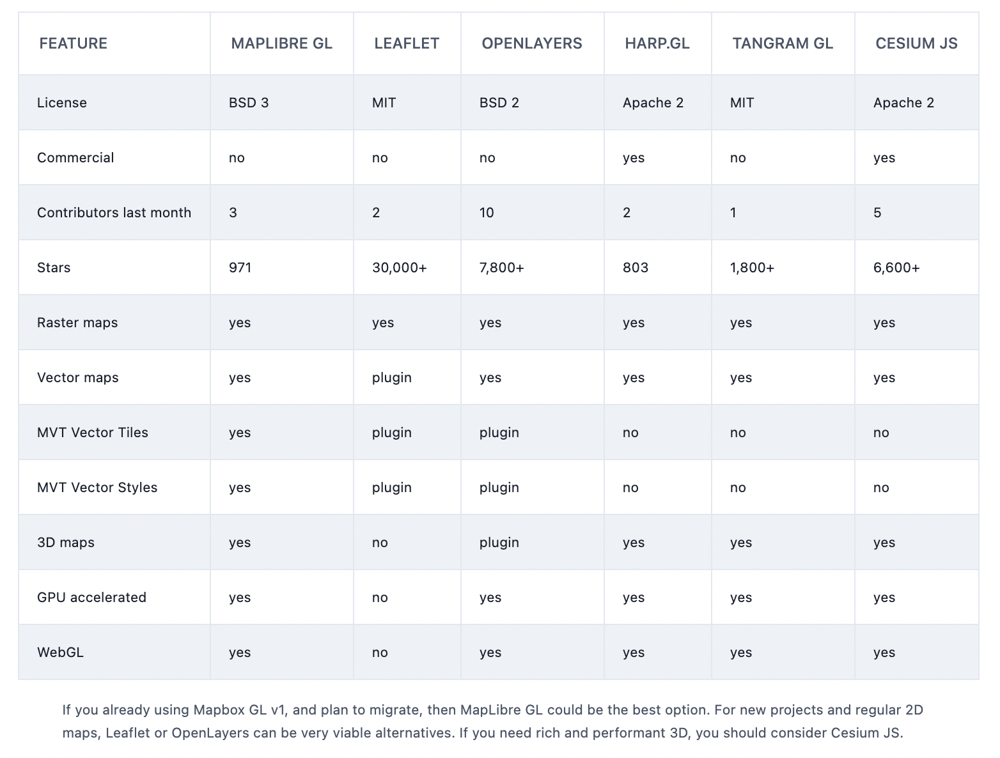

# Mapping Visualization Library

- Status: approved
- Deciders: Lucas Brown, Shelby Switzer, Nat Hillard
- Date: 2021-04-21
- Tags: frontend

Technical Story: [#7](https://github.com/usds/environmental-justice/issues/7)

## Context and Problem Statement

In order to visualize the metrics of the Justice 40 initiative, we need a client-side mapping solution. This solution should should reflect the values of our initiative, and it should reflect and respond to the diverse needs of our users.

**Team Values**: The solution should be open-source, modular, and adopt modern best practices.

**User needs**: The solution should be performant, accessible, internationalized/localized, and minimize data usage.

We provide more detail on these factors below.

## Decision Drivers

### Team Values

- **Open source** : Our technology choices should "default to open" as detailed in the [Digital Services Playbook](https://playbook.cio.gov/#play13), in order to encourage community contribution, minimize vendor lock-in, and lower the barrier to entry to participate in the development of the tool. Ideally such a solution should be be true [Free and Open Source Software](https://en.wikipedia.org/wiki/Free_and_open-source_software), licensed for use, copy, and modification as well as source code-visible.
- **Ease of implementation** : In the name of welcoming a large body of open-source contributors, our implementation should not require too significant insider knowledge of mapping or GIS systems. At the same time, more advanced functionality should be familiar to those who do have such backgrounds, to enable them to contribute expertise where warranted. Additionally, it should be possible to get an environment up and running locally without a necessary API key or other paid plan.
- **Modular** : we should minimize vendor lock-in and allow for mixing and matching solutions from different providers -- from server-vended tiling solutions to tile storage and basemaps -- in order to optimize user experience and find the best tool for the job at all layers of the stack.
- **Modern** : the library should allow for its work to be done entirely in the browser; it should provide the ability to load on demand (in binary, protobuf [format](https://github.com/mapbox/vector-tile-spec)) and visualize so-called [vector tiles](https://en.wikipedia.org/wiki/Vector_tiles) to make use of the rendering power of [WebGL](https://www.khronos.org/webgl/); and it should provide for client-side dynamic map styling according to relevant [standards](https://docs.mapbox.com/mapbox-gl-js/style-spec/) as opposed to just server-side pre-rendering of raster tiles.

### User Needs

- **Performant** : Library should be performant on a range of device types, enabling fast load times and ease of navigation in a highly-complex rendering environment where there may be hundreds of thousands of features.
- **Accessible** : the implementation we build with this library must be compliant according to [section 508](https://www.section508.gov/) of the Rehabilitation Act [(29 U.S.C. § 794d)](https://www.govinfo.gov/content/pkg/USCODE-2011-title29/html/USCODE-2011-title29-chap16-subchapV-sec794d.htm), as well as [Section 501](https://www.eeoc.gov/statutes/rehabilitation-act-1973) guidance regarding Reasonable Accommodation per US federal government legal requirements. Ideally it should adopt [Web Content Accessibility Guidelines](https://www.w3.org/WAI/standards-guidelines/wcag/) to at least the AA level. The library our solution builds upon should provide some of this out of the box.
- **Internationalized/Localized** : Nearly [22%](https://data.census.gov/cedsci/table?q=B16001&hidePreview=false&tid=ACSDT1Y2017.B16001&vintage=2018) of the US population speaks a language other than English at home. Our mapping solution should be familiar and easy to use by this population.
- **Minimizes network usage** : Where possible, we should seek to minimize network usage to ensure lower data usage costs and faster load times.

## Considered Options

1. [Mapbox GL JS](https://github.com/mapbox/mapbox-gl-js) - v2.2.0 (3/25/21)
2. [MapLibre GL JS](https://github.com/maplibre/maplibre-gl-js) - v1.14.0 (3/24/21)
3. [Leaflet](https://github.com/Leaflet/Leaflet) - v1.7.1 (9/4/20) + [Leaflet.VectorGrid](https://github.com/Leaflet/Leaflet.VectorGrid) - v1.3.0 (2017)
4. [OpenLayers](https://github.com/openlayers/openlayers) - v6.5.0 (12/27/20)
5. [ArcGIS API for Javascript](https://developers.arcgis.com/javascript/latest/) - v4.18 (12/2020)

## Not Considered Options

- Non-ArcGIS-JS-API Esri [products](https://www.esri.com/en-us/arcgis/products/index) - The focus of this investigation is web APIs that can be incorporated into a website and rendered as part of a cloud-based, modular web-development flow. Additionally, these are not open source.
- [Google Maps Platform](https://developers.google.com/maps)/[Bing Maps APIs](https://www.microsoft.com/en-us/maps/choose-your-bing-maps-api) - These mapping are also closed source and proprietary, and do not allow for significant customization or visualization of the sort we would need for this product
- [d3.js](https://d3js.org/) - though impressive in its offerings and performance, d3 appears more oriented to more general-purpose infographic use than a mapping-specific product requiring significant GIS-adjacent features. We may consider aspects of D3 for particular chart renderings.

## Decision Outcome

**OpenLayers** ([Source](https://github.com/openlayers/openlayers) - v6.5.0 (12/27/20)). This library is completely free and open-source, modular, and modern. As a modern, well-typed and well-documented javascript library, it is approachable, yet offers a full-featured and familiar interface as well for those with a background in GIS systems. As it is free to use, anyone could clone our source and run our project locally without payment or registration. Additionally, it has relatively good performance for large feature sets, despite not using WebGL for rendering.

### Positive Consequences

- **Licensing** : OpenLayers is BSD 2-Clause [licensed](https://github.com/openlayers/openlayers/blob/main/LICENSE.md)
- **More fully featured** : OpenLayers has a number of GIS features that other web-based tools do not. A somewhat older [analysis](https://link.springer.com/article/10.1007/s10109-017-0248-z) done in 2017 concluded that when compared to a set of considered features, OpenLayers 3 had a relatively large number of supported overall GIS features:
  
- **Popularity** : OpenLayers is second only to Leaflet in the number of Github [stars](https://github.com/openlayers/openlayers/stargazers) it has received, close to 8000
- **Performance** :
  - The below chart comes from an September 2020 [study](https://doi.org/10.3390/ijgi9100563). The purpose of this study was to compare OpenLayers to Mapbox-GL-JS and Leaflet (both raster and vector tile variants) as the potential basis for a Life Quality Index for 55,000+ census radius jurisdictions in Argentina.
     ([Source](https://doi.org/10.3390/ijgi9100563))
    In this chart, the two letters following the library name are for basemap layer and feature layer. Further, "R" is "raster" and "V" is vector, and lower numbers indicate faster load times. "OpenLayersRR" and "OpenLayersRV", (signifying a raster base layer and vector feature layer), performed quite well across all device types compared to other libraries.
  - We also performed local testing using puppeteer and web performance APIs, tested against a choropleth map of the cenus block groups, which represents a likely usecase for us. The results were as follows:
     ([Source](./0002-files/Maryland.csv))
    Testing and results can be found on the `client_perf` [branch](https://github.com/usds/justice40-tool/tree/client_perf) in this repository.
  - Finally, we tested these mapping solutions against a large dataset with many features, a map of national highways, at a lower zoom level. The tiles were still loaded on-demand, but the greater detail and number of features meant a more difficult render. Trends seemed similar to the above, with the exception of Leaflet:
     ([Source](./0002-files/Highways.csv))
    Notes:
    - OL+MB did not file the `tiledidload` event and thus there was not a separate measure for style loaded
    - Apparent performance was different from measured/reported overall, particularly when it comes to zoom performance. This is an area to dig into further and measured at a later time to understand better.
- **Data Usage** : The same study above also analyzed the amount of data usage for each of the libraries under investigation, and the result was the below chart (Lower values are better). OpenLayers overall performed quite well
   ([Source](https://doi.org/10.3390/ijgi9100563))

### Negative Consequences

- **Learning Curve** : A [recent survey](https://pea.lib.pte.hu/bitstream/handle/pea/23611/farkas-gabor-phd-2020.pdf?sequence=1) ranking various mapping libraries ranked OpenLayers as "Hard" in a scale from "Basic" to "Very Hard", and furthermore calculated "Approximate Learning Curve for Javascript", by which it was on the harder end as well (more detail in paper):
   ([Source](https://pea.lib.pte.hu/bitstream/handle/pea/23611/farkas-gabor-phd-2020.pdf?sequence=1))
  This is part of the tradeoff in the library's large feature set. Anecdotally, however, for the purpose of a simple choropleth map, implementation felt similar to other libraries.
- **Modern Stack** : OpenLayers requires a [plugin](https://github.com/openlayers/ol-mapbox-style) for the combination of MVT vector tiles and Mapbox GL Styles, though it does support it.
- **Rendering** : According to [geoapify](https://www.geoapify.com/mapbox-gl-new-license-and-6-free-alternatives), it has 'slightly less "polished" rendering quality and performance' compared to Mapbox/MapLibre GL. This is partly related to the fact that it does not yet support using WebGL for rendering anything more than points ([source](https://openlayers.org/workshop/en/webgl/points.html)).

## Observations

- **Accessibility**
  - Accessibility for web mapping technology in general is [not](https://wcag-maps.nicchan.me/) [good](https://sparkgeo.com/blog/the-accessibility-of-web-maps/). As of now, the default 2D visualizations in and of themselves do not provide explicit 508 compliance, and there is no official accessibilty [statement](https://www.w3.org/WAI/planning/statements/) for OpenLayers.
  - According to a recent exhaustive WCAG 2.1 [evaluation](https://github.com/Malvoz/web-maps-wcag-evaluation/) that compared several map providers, though almost all web maps performed [poorly](https://wcag-maps.nicchan.me/), OpenLayers came out in the middle of the pack:
     (Source: original [here](./0002-files/AccessibilityComparison.tsv), based on data [here](https://github.com/Malvoz/web-maps-wcag-evaluation/))
    This chart counts the number of successful WCAG 2.1 criteria from the above-linked study.
  - Mitigations:
    - According to at least one accessibility [expert](http://stackoverflow.com/questions/15659051/google-maps-508-accessibility-without-styles/16060809#16060809), it is sufficient for compliance reasons to provide an alternative means of viewing the same information provided by the map, perhaps in a table or other format. This is a common solution to this problem.
    - Though the library itself does not provide an accessibility guarantee, many of the 508 and WCAG standards are a matter of how you _use_ a particular library - e.g. ensuring proper color contrast, providing alternative markers not based on coloration, and providing text highlighting. We can guarantee that these are in place and ensure an accessibility audit of our featureset before release alongside user testing with low-vision and visually-impaired users directly.

## Pros and Cons of the Other Options

### Mapbox-GL JS

[Source](https://docs.mapbox.com/mapbox-gl-js/api/) - v2.2.0 (3/29/21)

#### Mapbox-GL JS Pros

- **Performance** : As can be seen in the above charts, Mapbox performed quite well in performance tests, in some instances performing the best of the examined options.
- **Data Usage**: In the data usage chart above, MapboxRV and MapboxVV also do quite well in the category of data usage.
- **Modern stack**: Mapbox supports WebGL rendering, vector tiles, and standardized tile styling
- **Modularity**: Mapbox interoperates with various basemap providers, and thanks to the open-sourcing of both its [vector tile format](https://docs.mapbox.com/vector-tiles/specification/) and its [styling language](https://docs.mapbox.com/mapbox-gl-js/style-spec/), there are a [number](https://github.com/mapbox/awesome-vector-tiles) of tools, libraries, and frameworks that easily interoperate with this solution.]
- **(Relative) Accessibility** : Mapbox-GL-JS came out 4th out of 12 in the above accessibility analysis. Mapbox also released several [patches](https://github.com/mapbox/mapbox-gl-js/pulls?q=is%3Apr++accessibility+) recently to address the issues that were found and are actively working on this.
- **Localization** : Through the mapbox-gl-language [plugin](https://github.com/mapbox/mapbox-gl-language/), it is possible to dynamically change the language of mapbox-provided basemaps to other languages. Additionally, they have a plugin for displaying [RTL languages](https://github.com/mapbox/mapbox-gl-rtl-text), and the [ability](https://docs.mapbox.com/mapbox-gl-js/style-spec/expressions/#types-number-format) to format numbers according to locale conventions.
- **Popularity** : According to [NPM Trends](https://www.npmtrends.com/mapbox-gl-vs-leaflet-vs-ol-vs-arcgis-js-api-vs-maplibre-gl) Mapbox-GL is the most downloaded package among those considered. More info [here](https://www.geoapify.com/map-libraries-comparison-leaflet-vs-mapbox-gl-vs-openlayers-trends-and-statistics)
  

#### Mapbox-GL JS Cons

- **Licensing** : Mapbox's December 2020 [announcement](https://github.com/mapbox/mapbox-gl-js/releases/tag/v2.0.0) of version 2.0 of their software changed ther license to proprietary and changed their pricing scheme to cover tiles loaded from outside of their service. This decision was met with [some criticism](https://joemorrison.medium.com/death-of-an-open-source-business-model-62bc227a7e9b) in the open-source mapping community.
- **Library Size** : Mapbox-GL is one of the larger libraries considered as far as filesize, coming in at 214.1 KB ([Source](https://www.npmtrends.com/mapbox-gl-vs-leaflet-vs-ol-vs-arcgis-js-api-vs-maplibre-gl))
- **Pricing** : As of version 2.0.0, Mapbox [charges](https://www.mapbox.com/pricing/#maploads) per "map load", defined as "every time Mapbox GL JS initializes on a webpage or in a web app". Up to 50,000 loads per month are free, and beyond this pricing varies. Users are likely to do a number of loads per sitting, however, so this is something we will need to consider, even in a relatively low-traffic tool.

### MapLibre-GL-JS

[Source](https://github.com/maplibre/maplibre-gl-js) - v1.14.0 (3/24/21)
MapLibre is a fork of Mapbox 1.13.0 that preserves the older BSD 3-clause license.

#### MapLibre-GL-JS Pros

- **Everything above** : Being a fork of Mapbox GL JS (though an earlier version), MapLibre has all of the benefits of Mapbox called out above
- **Licensing** : Returns to 3-Clause BSD [License](https://github.com/maplibre/maplibre-gl-js/blob/main/LICENSE.txt) means true FOSS licensing, as well as free operation

#### MapLibre-GL-JS Cons

- **Maturity** : This library is still quite young, having been formed only mid-December last year
- **Licensing Complications** : There may be licensing or legal challenges from Mapbox around the use of this tool
- **Component-based Wrappers** : Though supported by [react-map-gl](https://github.com/visgl/react-map-gl), there is not yet as full-featured support for MapLibre-GL in other component-based wrapper libraries
- **Backwards Compatibility** : There is an [issue](https://github.com/maplibre/maplibre-gl-js/pull/21) open now discussing the possibility of breaking backwards compatibility as part of a MapLibre 2.0 release. In practice this would mean we would not be able to use layers created within Mapbox in MapLibre tooling.
- **New Features** : There is not yet clarity on how and when this library would be updated and what its upcoming feature roadmap looks like

### Leaflet

[Source](https://github.com/Leaflet/Leaflet) - v1.7.1 (9/4/20) + [Leaflet.VectorGrid](https://github.com/Leaflet/Leaflet.VectorGrid) - v1.3.0 (2017)
Leaflet is a popular open-source mapping visualization library that has been around since 2010.

#### Leaflet Pros

- **Popularity** : Leaflet has by far the largest number of [stars](https://github.com/Leaflet/Leaflet/stargazers) on Gitbub (30,500 at the time of writing)
- **Modularity** : Leaflet has a [number](https://leafletjs.com/plugins.html) of plugins that augment its functionality, including [Leaflet.VectorGrid](https://github.com/Leaflet/Leaflet.VectorGrid) which enables Vector Tiles
- **License** : Leaflet is BSD 2-Clause [licensed](https://github.com/Leaflet/Leaflet/blob/master/LICENSE)

#### Leaflet Cons

- **Performance** : As seen above, Leaflet performance is quite poor across device types, relative to other libraries, even with the vector plugin
- **Modern Stack** : The lack of out-of-the-box vector tile support and the necessity of another library opens the possibility for version requirement mismatches and security vulnerabilities. Additionally, the last update to the VectorGrid plugin was a [year ago](https://github.com/Leaflet/Leaflet.VectorGrid/commits/master).

### ArcGIS API for Javascript

[Source](https://developers.arcgis.com/javascript/latest/) - v4.18 (12/2020)

#### ArcGIS API for Javascript Pros

- **Accessibility** : ArcGIS provides regularly-updated accessibility [conformance reports](https://www.esri.com/en-us/legal/accessibility/conformance-reports) detailing their products' conformance with 508 standards.
  - Note: These audits are not all up to date - the ArcGIS online evaluation was last completed in September 2018
  - Anecdotally, screen readers still struggle to read content without annotations - the onus is still on the map creator to ensure proper compliance.
- **Internationalization/Localization** : the API has its own `intl` module, described [here](https://developers.arcgis.com/javascript/latest/api-reference/esri-intl.html)
  - Note: The default ES6 `Intl` module appears to do all of the things described above without need for further modificaiton
- **Name recognition** : Esri in general holds "approximately 43% of the global market share and estimated annual revenues of approximately $1.1 Billion, from roughly 300,000 customers" ([source](https://digital.hbs.edu/platform-digit/submission/esri-and-arcgis/)). Relatedly, Esri tools interoperate well with other Esri tools, and their ecosystem is large.
  - Note: according to [one analysis](https://www.datanyze.com/market-share/mapping-and-gis--121) specifically the ArcGIS Web API holds only 0.48% of the marketshare overall.
- **Modularity** : As seen in ArcGIS [documentation](https://developers.arcgis.com/documentation/), Esri interoperates with Leaflet (through a custom fork), Mapbox GL JS, and OpenLayers.

#### ArcGIS API for Javascript Cons

- **License** : Most importantly, though Esri maintains a [handful](https://www.esri.com/en-us/arcgis/open-vision/initiatives/open-source) of open-source tools, ArcGIS API for JS itself, as well as many other tools within the Esri / ArcGIS portfolio, is [closed source](https://github.com/Esri/arcgis-js-api/blob/master/copyright.txt) and proprietary, hosting only minified versions of their software and not encouraging community contribution or feedback beyond forum contributions.
- **Complexity** : The feature set comes with the tradeoff of greater complexity in implementation for ArcGIS as well. Additionally, many more advanced features of the ArcGIS API require you to utilize the Dojo framework and/or Dijit components (see examples [here](https://developers.arcgis.com/javascript/latest/sample-code/widgets-frameworks-react/)), a requirement not held by other frameworks.
- **Modern** : ArcGIS-JS-API only recently got support for ES Modules in version 4.19 ([source](https://developers.arcgis.com/javascript/latest/release-notes/)). Additionally, many examples from earlier versions are still common, including in the ArcGIS API for JS documentation [itself](https://developers.arcgis.com/javascript/latest/get-started/), which still uses HTML includes. There are recently some newer [examples](https://github.com/Esri/jsapi-resources/tree/master/esm-samples) in github, but they also seem to have been recently added.

## Appendix A: Other comparisons

There are a handful of other similar comparisons out there, here are some references:

- Geoapify comparison ([Source](https://www.geoapify.com/mapbox-gl-new-license-and-6-free-alternatives))
  
- Flatlogic [Comparison](https://flatlogic.com/blog/top-mapping-and-maps-api/)

## Appendix B: Further Reading

- [Malvoz's WCAG 2.1 Summary](https://github.com/Malvoz/web-maps-wcag-evaluation/blob/master/README.md)
