# ADR Process

- Status: Proposed
- Deciders: Justice40 Team
- Date: 2021-05-10
- Tags: Process

Technical Story: N/A

## Context and Problem Statement

We should document the process of creating an ADR to provide clarity to committers of this project.

## Decision Drivers

- **Clarity** - Identify historical reasoning behind decision-making
- **Transparency** - Make decisions in the open
- **Currency** - ADRs reflect the current state of the world, but can be superseded by later decisions. The highest-numbered ADR reflects the most recent decision around a given topic.
- **Expediency** - We need good decisions, but good good software ships frequently. To balance these two factors, the ADR ensures we move forward in an informed way, but provides a way to self-correct as the world changes.

## Considered Options

- ADRs
- Informal Conversations
- Unilateral decision-making

## Decision Outcome

See Below for a way to use ADRs to make decisions on the project.

### What is an ADR?

An Architecture Decision Record is a text file, with a particular format, and an associated discussion. It is numbered for easy reference, and it has a general format.

### When Should I Create an ADR?

As outlined by Michael Nygard, ADRs represent "architecturally significant" decisions.

The subject of an ADR should affect one of the following areas:

- Structure
- Dependencies
- Interfaces
- Construction techniques

Small changes don't need one, but for larger changes that would introduce a new dependency or affect our overall system architecture, we recommend opening one.

### Process

Please see the below diagram:

1. **Start**: To create a new ADR, you have a few options:

   1. **Old fashioned file copy**: Copy `template.md` into a new file in this directory, named `XXXX-name-of-issue.md` where the `XXXX` part is incremented from the previous ADR.

   2. **ADR Tools**: Install `adr-tools` with `brew install adr-tools` then `adr new "Issue Name"` to make a new file. Copy contents of `template.md` in its place to get the right fields.

2. **Draft**: While your ADR is still being written, set the status to `draft`

3. **Proposed**: Fill out all fields, set status to `proposed`, and open a pull-request.

   1. We recommend [Mermaid](https://mermaid-js.github.io) for diagrams! Create a file with a `.mmd` extension and reference `filename-mmd.svg` in your docs, and Github Actions will automatically create the svg fore you! Preview diagrams with the Mermaid [Live Editor](https://mermaid-js.github.io/mermaid-live-editor/).
   2. To keep things organized, create a folder with the name `XXXX-files` and put supporting ADR material there.

4. **Email** Send an email to [the justice40-open-source Google Group](mailto:justice40-open-source@googlegroups.com) and link to the Pull Request created in (2). Set a deadline to solicit feedback, at most one week away.

5. **Consensus** In the event of consensus within the expressed timeline, feel free to merge.

6. **Concerns** If there are concerns raised, ensure that those that disagree understand the reasoning behind the decision and address concerns with specific mitigation steps. Request confirmation that concerns have been addressed. If so, merge!

7. **Discuss** In the event that disagreement persists, discuss the decision with the group in the next biweekly sync. Take a vote on next steps (opt-outs are OK!), and move forward.

8. **Merge**

   1. If the proposal is **approved** by this vote, set its status to `approved`, and merge the change.
   2. If it is **rejected**, set its status as `rejected`, and merge anyway for future reference!

9. **Update Other Issues** If people agree in discussion that this issue supersedes another, set the status of the other issue to `superseded`

10. **Close** Close the issue

### Positive Consequences

- Clarity on decisions
- A history of all decisions made on the project
- Inclusion of community voices in discussion of important topics

### Negative Consequences

- Folks have to follow a more involved process
- Might slow things down in the event of major disagreements

## Pros and Cons of Other Options

### Informal Conversations

- Pros: Easier, Faster
- Cons: Can leave people out

### Unilateral Decision Making

- Pros: The fastest option
- Cons: Many - less participation and inclusion, fewer perspectives.

## Links <!-- optional -->

- Documentation on the MADR [template](https://github.com/adr/madr)
- Blog [post](https://cognitect.com/blog/2011/11/15/documenting-architecture-decisions.html) introducing ADRs
