# Update ADR process to use Project board

## Context and Problem Statement

Our current [ADR process](./0003-adr-process.md) is a bit cumbersome. Let's update it by using Github project boards and PRs!

## Decision Drivers

- Using just filenames can result in naming collisions if another ADR is updated first
- The current "Status" field in the ADR itself can get out of sync with the actual status
- It is currently necessary to manually copy a template in order to initiate a PR
- The curent process necessitates email list discussion which can become separate from the decision itself

## Considered Options

- Continuing to use the existing process - this has the above drawbacks
- Using a different tool to track issues - this would separate the decision from the discussion

## Decision Outcome

We have created:

1. A new [project board](https://github.com/usds/justice40-tool/projects/2)
2. A new [issue template](https://github.com/usds/justice40-tool/blob/main/.github/ISSUE_TEMPLATE/decision-record.md)
3. A new process for using them, described below, that supersedes the previous [process](./0003-adr-process.md)

Chosen option: use github project boards as described below. Reasoning:

- We only update the file when a decision has been reached, thus avoiding naming conflicts
- We can use columns in project boards to represent status
- We can use the built-in issue template mechanism in github to enforce consistency
- Github offers a built-in discussion feature so we can capture discussion next to where the decision is made

Explanation of new process - to be added as a separate description later (updated diagram also to be posted as a comment here):

1. **Draft**: To create a new ADR:

   1. Create a new issue in [github](https://github.com/usds/justice40-tool/issues/new/choose) or [zenhub](https://app.zenhub.com/workspaces/justice40-60993f6e05473d0010ec44e3/issues/usds/justice40-tool/new?issueType=issue).
   2. Select the template "Architectural Decision Record".
   3. Select "Project", then "Repository", and set it to "Architecture decision records"
      This will create a new issue, add it to the "Draft" column (to be done via github actions), and assign the core project maintainers to approve

2. **Screenshots/diagrams**: If you need to add diagrams or screenshots/pictures, please add them to the comment section of the issue.

3. **Ready for Discussion** : The core project maintainers (for now the USDS folks until we have regularized this process) will review - they will:

   1. Add the "Ready for Discussion" label if the issue is well-formed / has enough detail
   2. Move the issue to the "In Discussion" column
   3. Setup a **public comment period** - this is the period within which we need to come to a decision (more on this below)

4. **In Discussion** : Once the item is in the "In Discussion" column, you have until the period specified to come to a decision. People can leave comments directly on the ticket There are several outcomes:

   1. **Consensus** In the event of consensus within the expressed timeline, move to the next step
   2. **Concerns** If there are concerns raised, ensure that those that disagree understand the reasoning behind the decision and address concerns with specific mitigation steps. Request confirmation that concerns have been addressed. If so, move to the next step!
   3. **Discuss** In the event that disagreement persists, discuss the decision with the group in the next biweekly sync. We will take a vote on next steps (opt-outs are OK!), and move forward.

5. **Decided**: Once the comment period has elapsed, move the issue to "Decided". This is where the issue will wait before you have created a Pull Request. Please at this time add one of the following labels:

   - "Approved" -- Decision Record has been approved
   - "Rejected" -- Decision Record has been rejected
   - "Superseded" -- Decision Record has been made obsolete by another record (leave in comment) -- please add this to any record your record supersedes.

6. **Pull Request**: Once decided, you should create a pull request to create a file in `docs/decisions` - name it `XXXX` where `XXXX` is one greater than the largest decision record in the directory. Copy and paste the record from the issue. As for diagrams and

   1. We recommend [Mermaid](https://mermaid-js.github.io) for diagrams! Create a file with a `.mmd` extension and reference `filename-mmd.svg` in your docs, and Github Actions will automatically create the svg fore you! Preview diagrams with the Mermaid [Live Editor](https://mermaid-js.github.io/mermaid-live-editor/).
   2. To keep things organized, create a folder with the name `XXXX-files` and put supporting ADR material there.

7. **Merge**: once the PR has been approved, merge and close

### Positive Consequences

- ADRs no longer have the above-named limitations

### Negative Consequences

- We'll need to discuss and socialize these changes.

## Pros and Cons of the Options

### Leaving as Is

- Good, because it's maybe a little less involved
- Bad, because it requires keeping a fragile text file up to date, and separates discussion from decision, and is not as integrated into the process

### Another tool

e.g. Trello etc.

- Good, because there are other tools that are purpose-built to move tickets left -> right
- Bad, because this is yet another tool we've got to integrate, and it separates discussion from decision again

## Links

- [Previous ADR process](./0003-adr-process.md)
- [New project board](https://github.com/usds/justice40-tool/projects/2)
- [New issue template](https://github.com/usds/justice40-tool/blob/main/.github/ISSUE_TEMPLATE/decision-record.md)
